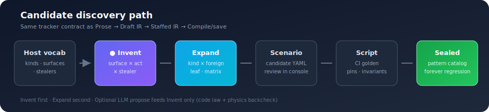

# Conjecture Behaviour Runner

**Catch state-law breaks that still look fine in chat.**

Regression for multi-turn **state law** (owner · pin · handoff) under **pinned
cognition** — *looks fine in chat, broken underneath* — against **LLM proposes · code
enforces**.

**Why this exists (doctrine + failure modes):**  
[**Conversational Authority Quality (CAQ-FM)**](docs/conversational-authority-quality.md)  
https://github.com/walidnegm/conjecture-behaviour-runner/blob/main/docs/conversational-authority-quality.md

That guide owns the full pitch (state-law breaks, the enforce half, CAQ-FM map). This
README is the package face: install, demos, drivers, what gets checked after each turn.

| Doc | What it is |
|-----|------------|
| [**CAQ-FM guide**](docs/conversational-authority-quality.md) | Conceptual home — start here for *why* |
| [**Mode catalog**](incidents/CATALOG.md) | Full list of modes (runnable / pending / host_only) |
| [**Registry**](incidents/registry.yaml) | Machine SoT (`id` ↔ `portable_seed`) |
| [**Land playbook**](incidents/README.md) | Classify → capture → patterns/ |

**Owners and kinds are yours, not Conjecture’s.** The package does not ship a fixed
catalog of agents or task types. Whatever **type** your ledger defines—
`cost_out`, `invoice_intake`, `claim_review`, `onboarding`, a Temporal activity name,
a LangGraph node id—is what you assert as `exclusive_owner` / `active_kind`. The
same for pins: `workflow_id`, `claim_id`, `invoice_id`, … — host vocabulary projected
into Observation. Demos below use **`cost_out` + `workflow_id` only as a concrete
stand-in** from the path-faithful mini-app (Conversation Control Plane dogfood). Swap
the strings for your ledger; the invariants stay the same shape.

**Parameterized templates** (shareable shapes, not product goldens):  
`sole_continue_script(...)` · `reorient_keeps_owner_script(...)` · docs in
[`templates/README.md`](templates/README.md). Example:
`python examples/parameterized_templates.py`.  
CCP host law (reorient ≠ COMPLETE, every result names a transition):
[Host transition discipline](https://github.com/walidnegm/conversation-control-plane/blob/main/docs/host-transition-discipline.md).

CI needs a **fixed classification** (pin or freeze), not a live model roll every
run—so the same golden fails for the same state break on every PR. That is deliberate:
this package does **not** prove the classifier was right. Pair it with separate
classifier tests for cognition drift; use Conjecture for “given these labels, did code
still seal the ledger?”

The ledger can live anywhere (session DB, LangGraph, Temporal, Vercel AI session, …).
If you can project **your** owner/kind/pins after Act, you can import a Driver and get
a **verdict**.

MIT · **0.1.6** · [Bot0.ai](https://bot0.ai)

---

## What this package checks

**Not** “did steps run in the right order?” (ordinal / unit tests).  
**Not** “did the bot write a good sentence?” (LLM eval).

**Yes:** after each user message, do the **deterministic ledger + handoff rules** still hold —
the coded rule-set that says who owns the turn, what is pinned, and when ownership may
yield — even when an LLM *proposes* something that would steal or hijack if code did not
enforce?

| Check | Meaning (host-defined values) |
|-------|---------|
| **Who owns this turn?** | Your ledger’s exclusive owner / kind string vs front door / idle |
| **What is locked?** | Your pin map (whatever ids the host freezes for this task) |
| **Mid-flight / handoff law** | No illegal restart, no silent pin drop; handoff only when *your* rules allow |

**Demo shape only** (mini-app vocabulary — not the only kind Conjecture knows):

```text
# Host example vocabulary: kind=cost_out, pin key=workflow_id
# (could just as well be claim_review + claim_id, invoice_intake + invoice_id, …)

User: "start <your mid-flight task> on record R"
User: "change a field mid-flight"     ← reply can still sound fine

Unit / ordinal tests:  ✅ something returned
LLM eval:              ✅ text looks helpful
Conjecture:            ✅ exclusive_owner still equals the kind your ledger started
                       ✅ pin still equals the same record id
                       ❌ FAIL if continue stole to front_door or dropped the pin
```

In the shipped mini-app that kind string is `cost_out` and the pin is `workflow_id=wf_1`
— convenient dogfood, **not** a product enum.

### Who “deserves to go next”?

In a control-plane style app, that is **not** “parse the last chat line for keywords.”
It is roughly:

1. **Ledger state** — what **kind** is mid-flight?  
   (`active_task.kind` / `exclusive_owner` — **any string your rule-set defines**)  
2. **Entity pin** — which record is locked?  
   (**any** pin keys your host freezes: workflow, claim, ticket, …)  
3. **This turn’s classification** (pinned for CI) — `continue` vs `detour` vs `new_task` / `abandon`

If the ledger says kind **K** is active and the turn is **continue**, **K** owns
delivery even if the user text *looks* like a detour (glossary, FAQ, another product
surface). If the turn is **detour** / **abandon**, ownership **yields** per your rules.

Conjecture asserts those rules still held **after** Act for the **expected strings you
wrote in the golden**. Ordinary ordinal tests do not model exclusive owner or pins.

### Where the ledger lives (does not matter)

Conjecture does **not** require a specific product stack for the ledger. The durable
state may live in:

- a custom DB / JSON session blob  
- **LangGraph** / LangChain checkpoint state  
- **Temporal** workflow state  
- **Vercel AI SDK** / other session stores  
- any control plane that projects **owner · pins · outcome** after a turn  

**What matters:** you have a **rule-set** (coded handoff / sole-continue / pin law) and a
**Driver** that runs Act and returns an **Observation** Conjecture can check. Import
your adapter (or HTTP JSON paths), pin the labels, run the script → **verdict**
(PASS/FAIL + which invariant broke). No need to rewrite the ledger into Conjecture’s
types beyond that projection.

> **Honest scope:** this gates **enforcement** given a pin/freeze — not “the classifier
> was wrong.” Test cognition separately; use Conjecture for owner/pin/handoff regression.
> Full doctrine: [CAQ-FM](docs/conversational-authority-quality.md).

---

## 30-second proof (two paths)

### A. In-process mini-app (fastest)

```bash
git clone https://github.com/walidnegm/conjecture-behaviour-runner.git
cd conjecture-behaviour-runner
pip install -e ".[dev]"

conjecture path-faithful --prove-bugs   # PASS + 3 planted FAILs
# optional local demo UI (not a product — just a viewer):
conjecture ui --port 8765
```

### B. External HTTP app (true portability)

The strongest claim: the **system under test does not import Conjecture**.

```text
proofs/external_http_app/   ← independent SUT (no conjecture imports)
        ↓ HTTP only
HttpJsonAdapter + portable golden + verifier
```

```bash
PYTHONPATH=src python proofs/run_external_http_proof.py --prove-bugs
```

That spawns four independent HTTP processes (healthy + `owner_steal` / `drop_pin` /
`illegal_restart`) and proves the same contracts under **pinned cognition** (`LlmMode.STUB`).

---

## Minimal golden

The mini-app’s mid-flight kind is hard-coded to `cost_out` for the proof path.
On **your** host, replace `cost_out` / `workflow_id` with whatever owner and pin
keys your ledger emits in Observation.

```python
from conjecture_behaviour_runner import (
    ConjectureScript, DialogueTurn, InvariantSpec, CognitionPin,
    run_script, LlmMode,
)
from conjecture_behaviour_runner.path_faithful import MiniAppAdapter, MiniChatApp

# Demo vocabulary only — your golden uses YOUR ledger strings:
#   exclusive_owner / active_kind  e.g. "cost_out" | "invoice_intake" | "claim_review"
#   pin keys                       e.g. "workflow_id" | "invoice_id" | "claim_id"
script = ConjectureScript(
    script_id="demo",
    description="continue keeps host owner and pin",
    conversation_id="conv_1",
    turns=[
        DialogueTurn(
            user_text="cost out the onboarding workflow",
            pin=CognitionPin(task_intent="new_task", read_kind="cost_out"),
            invariants=[
                InvariantSpec(kind="exclusive_owner", expected="cost_out"),
                InvariantSpec(kind="pin_present", expected="workflow_id"),
            ],
        ),
        DialogueTurn(
            user_text="make the volume 10k",
            pin=CognitionPin(task_intent="continue"),
            invariants=[
                InvariantSpec(kind="exclusive_owner", expected="cost_out"),
                InvariantSpec(
                    kind="pin_equals",
                    expected={"key": "workflow_id", "value": "wf_1"},
                ),
            ],
        ),
    ],
)
result = run_script(
    script, adapter=MiniAppAdapter(MiniChatApp()), llm_mode=LlmMode.STUB
)
assert result.passed
```

### Wire your own HTTP app

```python
from conjecture_behaviour_runner.contrib.http_json import HttpJsonAdapter

adapter = HttpJsonAdapter(
    endpoint="http://localhost:8000/chat",
    owner_path="debug.owner",
    pins_path="debug.pins",
    outcome_path="debug.outcome",
)
# result = run_script(script, adapter=adapter, llm_mode=LlmMode.STUB)
```

---

## Five concepts (public model)

**Script · Turn · Driver · Observation · Invariant**

Everything else (Scenario, ODD, multi-runner, Verdict) is advanced — [`docs/SPEC.md`](docs/SPEC.md).

Local browser UI (`conjecture ui`) is a **demo viewer**, not a second product.

### Candidate discovery (expander · inventor · optional LLM propose)

Autonomously author **candidate Scenarios** from **your** host vocabulary — not a
fixed product catalog. Normative detail: [`docs/SPEC.md` §2.2](docs/SPEC.md).

Same **progress tracker** idea as product authoring
(Prose → Draft IR → Staffed IR → Compile/save) — one ordered ladder, current stage
highlighted, completed stages struck. Reusable contract:
`conjecture_behaviour_runner.pipeline_tracker`.



```text
📍 Discovery path: Host vocab → Invent → Expand → Scenario → Script → Sealed
```

| Stage | What happens |
|-------|----------------|
| **Host vocab** | Your kinds · exclusive surfaces · pre-decide stealers · typed acts |
| **Invent** | Geometry: surface × typed act × stealer (prefer first) |
| **Expand** | Cross-product: kind × foreign leaf · matrix / residual seeds |
| **Scenario** | Candidate YAML (console review — not CI yet) |
| **Script** | Executable golden (pins · invariants · freeze) |
| **Sealed** | Pattern catalog / host ratchet — forever regression |

| Engine | Role |
|--------|------|
| **Inventor** (prefer first) | Code geometry: exclusive surface × typed act × pre-decide stealer |
| **Expander** | kind × foreign leaf; matrix / residual / incident seeds |
| **Propose** (opt-in) | LLM suggests new surfaces/stealers; **code** law + physics backcheck |

```bash
conjecture candidates author --example --out /tmp/cbr_candidates
# Optional invent LLM (no product model hardcode — set your endpoint):
#   CONJECTURE_INVENT_LLM_BASE_URL / _MODEL / _API_KEY
conjecture candidates author --example --invent-llm --out /tmp/cbr_candidates
CONJECTURE_CANDIDATES_DIR=/tmp/cbr_candidates conjecture ui
```

Defaults: **4** LLM proposals and **4** inventive scenarios per author turn
(`CONJECTURE_INVENT_MAX_*`). Prompt is a file, not inline product prompts:
`candidate_author/prompts/geometry_propose.md`. Full env table and vocabulary
fields: [`templates/candidate_author/README.md`](templates/candidate_author/README.md).

---

## Planted-bug table (machinery)

| Run | Result | Break |
|-----|--------|--------|
| Healthy | **PASS** | — |
| Owner steal | **FAIL** | Continue reports `front_door` while task active |
| Drop pin | **FAIL** | Lost `workflow_id` |
| Illegal restart | **FAIL** | Task wiped mid-flight |

---

## Contribute

[CONTRIBUTING.md](CONTRIBUTING.md) — matrix, sized issues, five-minute path.

Help wanted: real host samples (HTTP), LangGraph/Temporal adapters, **incident patterns**.

### Learning loop (bugs → patterns)

When an agent submits the wrong type into the ledger or skips the ledger contract,
and the **SDK is already complete**, that is often a **Conjecture-class** bug.
Classify → Scenario → Script → catalog:

- **Patterns inventory (list + describe):** [`incidents/CATALOG.md`](incidents/CATALOG.md)  
- Playbook: [`incidents/README.md`](incidents/README.md)  
- Template: [`incidents/_template/`](incidents/_template/)  
- Patterns: [`incidents/patterns/`](incidents/patterns/)

### Where to go (docs map)

| Need | Path |
|------|------|
| Hero demo / planted bugs | this README (above) |
| **Failure-class inventory** | [`incidents/CATALOG.md`](incidents/CATALOG.md) |
| How to land a pattern | [`incidents/README.md`](incidents/README.md) |
| Package unit tests | [`tests/`](tests/) — **not** the inventory |
| Demos / E2E scripts | [`examples/`](examples/) |
| Script shapes (any host kind) | [`templates/README.md`](templates/README.md) |
| Candidate discovery (expand + invent) | [`templates/candidate_author/README.md`](templates/candidate_author/README.md) · SPEC §2.2 |
| Normative spec | [`docs/SPEC.md`](docs/SPEC.md) |
| Agent coder files-first | [`AGENTS.md`](AGENTS.md) §7 |

---

## License

MIT · Copyright © Bot0.ai / contributors.
