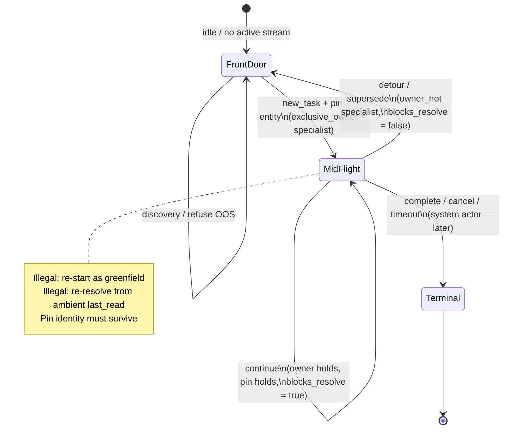

# Conjecture Behaviour Runner Specification

| Field | Value |
|---|---|
| **Document type** | **Specification** (normative) |
| **Document ID** | `CBR-SPEC` |
| **Canonical path** | [`docs/SPEC.md`](./SPEC.md) |
| **Title** | Conjecture Behaviour Runner Specification |
| **Version** | **0.1.5** (alpha) — HTTP e2e proven; face claim frozen-cognition honesty; single version |
| **Status** | **Active** — authoritative for claim, Script/verifier contracts, scope |
| **Audience** | Integrators, contributors, agent authors of goldens |
| **Companion face** | [README](../README.md) — **lead with planted-bug demo**; use cases; trap line |
| **Agent coder guide** | [AGENTS.md](../AGENTS.md) — integrate host + author goldens |
| **Prompt seed** | [prompts/conjecture_script_author.seed.md](../prompts/conjecture_script_author.seed.md) — trajectory + ODD → Script |
| **Implementation package** | `src/conjecture_behaviour_runner/` · version **0.1.5** (see `_version.py`) |
| **Claim hierarchy (locked)** | **Face (plain):** catch agent bugs that still look fine in chat · **Precise:** freeze-safe state-law gates · **Technical:** envelopes / pin-freeze · **Gloss:** CCP-shaped conformance only — see §0 |
| **Package** | `conjecture-behaviour-runner` · import `conjecture_behaviour_runner` · **MIT** |
| **Inspiration / primary pattern** | [Conversation Control Plane](https://github.com/walidnegm/conversation-control-plane) — hosts isomorphic to that format are the apt application |

**What “Specification” means here:** this document is the **normative source of truth** for
behaviour, contracts, and extension points. Code implements it; the README popularizes it.
It is **not** a marketing brief, ADR log, or epic backlog (those live elsewhere).

---

## 0. Finalized product claim (normative)

This section freezes the market/architecture decisions from design review. Later
slices implement; they do not redefine the wedge without a SPEC version bump.

### Claim hierarchy (locked — do not invert)

Three layers. **Face wins** on the homepage and pitch (plain English first). Sticky
mechanism language **supports** the face claim; it does **not** expand it into platform theater.

| Layer | Plain English (user-facing) | Precise wording | Role |
|---|---|---|---|
| **1. Face** | **Catch the agent bugs that still look fine in chat** — CI fails when mid-conversation **rules** break (who owns the turn, which record is locked), not when wording changes | Freeze-safe regression gates for control-plane **state law** (owner · pin · mid-flight/terminal) under pinned cognition | Hero + buyer pitch |
| **2. Technical** | Test conversation **machine rules**, not essay quality; freeze AI decision labels so PR checks are cheap and repeatable | Contract testing for the conversational control plane — behavioral envelopes (allowed outcomes + invariants) over authoritative state, under pinned or replayed cognition. Not “one golden sentence.” Not a new universal testing paradigm. | How green is defined |
| **3. Architecture** | For apps that work like a control plane (one owner, locked records, clear finish) — not every chatbot | Authoritative control-plane conformance under probabilistic cognition — **when** the host is CCP-shaped (or isomorphic) and Act is under a real Driver | Research gloss; scoped |

#### Face (layer 1) — plain then precise

**Plain (lead with this):**

| | |
|--|--|
| **Why** | Multi-turn agents fail *quietly*: the reply can sound fine while the system lost the task owner, dropped the locked workflow/invoice, or restarted finished work. Wording scores miss that. |
| **What** | Regression goldens that check **conversation machine rules** after each turn (owner, pin, mid-flight vs restart). |
| **So** | **CI goes red** when those rules break — even if the prose still looks polished. AI labels are **pinned/frozen** so checks stay fast and identical every PR. |

**Precise (spec short name):**

> **Freeze-safe regression gates for control-plane state law** —  
> owner · pin · mid-flight / terminal under **pinned or replayed cognition**.  
> Red bar when state breaks **even if the reply still looks fine**.

#### Technical definition (layer 2 — sticky; keep under face)

> **Contract testing for the conversational control plane** —  
> **behavioral envelopes** (allowed outcomes + invariants) over **authoritative state**,  
> under **pinned or replayed cognition**.  
>  
> Not “one golden sentence.” Not a new universal testing paradigm.

#### Architecture gloss (layer 3 — scope required)

> Authoritative control-plane **conformance under probabilistic cognition** —  
> for CCP-shaped hosts, as **state-law regression** under pin/freeze, proved on a real Act
> path where available. Full live classify→route→mutate discovery is **next Driver**, not the face sell.

**Align rule:** layer 2 ⊂ layer 1. Layer 3 must not be sold without the CCP-shaped + Act scope.  
**Pitch that wins:** we do not care about adjectives; we care that legal state, pins, and
mid-flight law held.

### Inspiration and who it is for

| | |
|--|--|
| **Inspiration** | [Conversation Control Plane](https://github.com/walidnegm/conversation-control-plane) — single-writer turn ownership, entity pins, sole-continue / detour / terminal discipline |
| **First adopter** | Dogfood: CCP + Bot0-class hosts (own that) |
| **Apt applications** | Transactional / high-stakes multi-turn agents that **model** ownership, pins, terminals (FinTech, supply chain, healthcare ops, invoice/workflow ledgers, multi-agent handoffs) |
| **Not apt** | Pure creative chat; general Q&A with no authoritative mid-flight state; “grade my prose” |

Orchestrators (LangGraph / Crew / Temporal) are **Driver surfaces** only when the host
projects a CCP-**isomorphic** observation. They are not a free market of “any agent app.”

### What we test (and what we do not)

| We test | We do **not** primarily test |
|---|---|
| **Control-plane law:** exclusive owner, active kind, entity pins, mid-flight vs front door, detours, terminals, blocks_resolve / no illegal restart | Model wording, tone, preference scores, leaderboards |
| **Behavioral envelopes:** legal landings + state that must hold | “The conversation was good” |
| **Ground truth on state:** expected outcomes + invariants (required for CI goldens) | Hypothesis-only scripts with no expected result |
| **Regression of known law** under freeze | Emergent discovery of unknown bugs under free live LLM |
| Optional later: domain facts *if* projected into observation + verifier kinds | Built-in full domain sim / world model |

**Critical trap:** do **not** turn Conjecture into a general-purpose chat validator.
Prose-style asserts make the framework feel restrictive and brittle — out of scope.

### Silent failure and CI determinism (why the wedge exists)

| Problem | What Conjecture does |
|---|---|
| **Silent failure** | Text looks fine to humans / LLM evaluators while owner, pin, or terminal law is broken |
| **Entity lock / ambient hijack** | Mid sensitive workflow, ambient turns must not drop or swap the bound id |
| **Terminal compliance** | No illicit re-activate or mutate-after-complete |
| **Handoff integrity** | Exclusive owner shifts without dual-writer |
| **CI cost** | Pin/freeze cognition → cheap, repeatable gates without live LLM on every PR |

### What is demonstrated vs vision

| **Demonstrated today (sell this)** | **Vision (not the face claim)** |
|---|---|
| Path-faithful mini-app: real `handle()`, planted bugs go red | Full multi-runner Scenario platform |
| Script + verifier + freeze/record | Generation, shrink, N-run hold-rate product |
| CCP-shaped portable kinds + optional stream unit goldens | Turnkey “any LangGraph app” without isomorphic state |
| Contract regression harness with shared vocabulary | Emergent bug hunting under free live multi-step cognition |

Face vocabulary: **golden (Script) · run · verifier**.  
Richer ontology (Scenario, multi-runner, seeds, Verdict) is architecture — not the 30-second pitch.

### Product naming: trajectory, Scenario, Script (locked)

**Trajectory is first-class.** We almost lost it by over-focusing on the control-plane
play-back driver. Put it back:

| Product name | What it is | Code today | Maturity |
|---|---|---|---|
| **Authored trajectory** | The load-bearing **twists & turns** story (what could break law) | Carried inside Scenario / Script | Concept **stable**; authoring depth varies |
| **Conjecture Scenario** | Flexible **description language** for that trajectory + envelopes | `experimental.Scenario` (+ `schema.json`) | **Early** — models exist; not full multi-runner platform |
| **Conjecture Script** | **Runnable play-back** of a trajectory for a chosen runner | `ConjectureScript` (**stable** for control-plane runner) | **Most mature** path we ship |
| **Observed trajectory** | Evidence of **one** execution under one profile | `Trajectory` / `RunResult` | Partial (RunResult solid; rich Trajectory experimental) |
| **Runner** | **Who executes** the Script | Control-plane: `run_script`; others roadmap | One runner mature; multi-runner **not** |
| **Verifier** | Expected envelopes vs **observed trajectory** | `invariants.py`, `temporal.py` | Solid for control-plane kinds; domain plugins open |

```text
  seeds (specs · Collinear/other multi-turn tools · agent · human)
              │  curate + attach expected envelopes
              ▼
  authored TRAJECTORY of twists  (load-bearing path story)
              │
              ▼  described as
  Conjecture Scenario  and/or  Conjecture Script
              │
              ▼  who runs it? (explicit — file does not run itself)
     ┌────────┴────────┐
     ▼                 ▼
  control-plane    other runners
  runner           (roadmap)
  (run_script)
     └────────┬────────┘
              │ Driver plugin (HTTP · Playwright · LangGraph ·
              │               Temporal · Crew · in-process · …)
              ▼
       Real application
              │
     OBSERVED TRAJECTORY  →  VERIFIER  →  pass/fail
              │
       pytest / CI only *hosts* the run
```

| | **Conjecture Scenario** | **Conjecture Script** |
|---|---|---|
| Job | Flexible language for *which twists* and *what must hold* | Form a **specific runner** can execute today |
| Contains | steps, actors, scope, nondeterminism envelopes, waits, evidence | turns, pins, effects, `InvariantSpec`s |
| Tied to one driver? | **No** | Bound to a runner (today: control-plane `run_script`) |
| Agent authors | Can write either; Script is the usual CI golden | Yes — and that file *is* the test case |

**Mnemonic:** Scenario *describes* the trajectory of twists; Script *plays* it; observed trajectory *is what happened*; Verifier *judges*.

### Maturity (one box — do not bury the hero)

| **Do this today** | **Scaffolding** | **Vision** |
|---|---|---|
| Path-faithful mini-app + planted bugs | Scenario models + compile | Multi-runner play-back |
| Script + `run_script` + verifier + freeze | Agent prompt seed | Generation / shrink / distributions |
| CCP-shaped goldens (unit + demo) | CLI / JSON / JUnit | First-party orchestrator packages |

**Market today:** freeze-safe **state-law regression** for CCP-shaped multi-turn hosts, proved on a real Act path in-repo.  
**Do not market:** complete behaviour platform, free discovery, or “any agent without owner/pin state.”

### Seeds (including Collinear and peers)

**We can and should use output from Collinear-class sims and other multi-turn tools** as
**seeds** — path material to curate into authored trajectories (Scenario/Script) **with
expected envelopes**. That is composition, not competition:

| External tool | How we use it |
|---|---|
| Collinear / multi-turn sim labs | Export or note multi-turn paths → attach **expected state** → Script/Scenario → our runner/verifier |
| Session traffic / explorers | Same: path seed, not automatic green bar |
| Coding agents | Author Script/Scenario (artifact *is* the golden) |
| Specs / incidents | Primary source of *which* laws to encode |

Their green bar (quality scores, sim success) is **not** our green bar. Our gate remains:
**observed trajectory satisfies declared envelopes.**

**Without a runner + verifier**, Scenarios/Scripts are inert files.  
**Without trajectory-of-twists thinking**, you only have an ad-hoc driver API.

### Orchestration engines (LangGraph, Crew, Temporal, …)

**Compose — do not replace.** Engines orchestrate; Conjecture gates law.

```text
  seeds → Conjecture Scenario → Conjecture Script
                                      │
                                      ▼  control-plane runner (or other)
                            Driver plugin ← LangGraph / Crew / Temporal / …
                                      │  (orchestrator is host + Driver surface)
                                      ▼
                               Real application
                                      │
                            observed trajectory → VERIFIER
```

| Engine | Typical fit |
|---|---|
| **LangGraph** | Driver: invoke/stream graph; Observer: checkpoint / thread state → owner, pins, outcome |
| **CrewAI / multi-agent** | Agent→agent turns; exclusive owner; pin across handoff; no dual writer |
| **Temporal** | System/completion turns; job done / cancel / timeout; no mutate-after-terminal |
| **Others** | Same adapter pattern: project runtime state → `TurnObservation` |

Shipping first-party packages for each engine is **roadmap**; the **extension contract** is finalized.

### How we sit in the stack (locked — differentiate by job, not brand tables)

We do **not** define Conjecture as “unlike Product X.” We define it by **job and green bar**.

| Layer | Examples | Relationship to Conjecture |
|---|---|---|
| **Orchestration** | LangGraph, Crew, Temporal, custom FSMs | **Hosts** — they run work; we gate state law via Driver/Observer |
| **UI / transport drivers** | Playwright, HTTP, SSE, WebSocket | **Plugins** called by *our* runner |
| **Process host** | pytest, CI, JUnit | Invokes `conjecture run` — not the verifier |
| **Exploration / sim / eval (optional)** | Multi-turn sim labs, trajectory scorers | May **seed** paths or score in parallel; **do not set our green bar** |
| **Commercial (optional)** | **Verdict** | Hosted/faster/different surface; may use or reimplement cores |

**Our green bar (differentiation):** declared control-plane (and projected) contracts hold
under pinned/frozen cognition. That is the product. Everything else is input or plugin.

### Ground truth (required for helpful goldens)

A CI golden is a **probe + expected result**, not a hypothesis sketch:

- **Expected:** `allowed_outcomes` and/or invariants (step and/or trajectory)  
- **Optional later:** observation snapshot, terminal bucket, domain asserts  
- **Exploratory** scripts (no expected) must not gate merge  

Authoring (human or agent) must emit expected contracts against the schema.

**Agent-written Script is the test case.** A coding agent following
`prompts/conjecture_script_author.seed.md` should produce the golden file the runner
executes — not a prose plan that still needs hand translation. Product laws remain
human-owned; the agent **encodes** them into Conjecture Scenario and/or Script.

### What “green” means

| Green means | Green does **not** mean |
|---|---|
| Declared control-plane (and any projected) contracts held under pinned/frozen cognition | The model’s prose was good |
| Verifier passed on observations from the host adapter | Every orchestration edge was exhaustively explored |

### Doc balance (README vs this Specification)

| | **README** | **This Specification (`CBR-SPEC`)** |
|---|---|---|
| **Document type** | Project face / getting started | **Specification** (normative) |
| **Job** | Why / how to start / friendly script language | Design, tables, field contracts, scope |
| **Pipeline · ecosystem · scope** | Short face + links here | **Full** diagrams and extension map |
| **Conjecture Script** | Intro + kinds + mini story | Field tables, multi-turn patterns, mid-flight state machine, golden JSON |
| **Contributions / Verdict** | One paragraph + link | **Full** maps and commercial boundary |
| **On conflict** | Follow **this Specification**; update README |

Claims below distinguish **what is true today** from **aspiration**.

---

## 1. Problem and claim

### What is genuinely valuable

Probabilistic conversational systems should be tested against a **behavioral envelope** —
**permitted outcomes** plus **invariants over authoritative state** — not against one exact
sentence or one ideal trajectory.

| Ingredient | Role |
|---|---|
| **Cognition pins** | Separate probabilistic semantic interpretation from deterministic execution testing |
| **Allowed outcomes** | Multiple conversational landings can be correct |
| **Invariants** | Must remain true regardless of wording or path |
| **Authoritative focus** | Ownership, active work identity, routing, terminals, ledger integrity |

None of those ingredients is novel alone. The defensible combination (claim hierarchy
**layer 3**, always scoped — see §0) is:

> Authoritative control-plane conformance under probabilistic cognition —  
> **as freeze-safe state-law regression for CCP-shaped hosts**, not as a universal agent-test platform.

Not “a completely new testing paradigm.” Face claim remains **layer 1** (§0).

### Failure modes that string / pure quality scores miss

| What goes wrong | Why wording checks miss it |
|---|---|
| **Wrong control flow** mid-task | Reply still “looks fine” |
| **Identity or state lost** across turns | No fixed sentence fails |
| **Illegal landing** (restart, wrong mode, silent degrade) | Snapshot of one turn still green |
| **Dual writers / steals** | Trajectory “score” can still be high |

### Proof paths (critical — claim matches artifact)

| Path | What it proves | Role in the product story |
|---|---|---|
| **Path-faithful mini-app** (`handle()` + planted bugs) | On a **real Act** surface, dual-owner / drop-pin / illegal-restart go **red** while replies can look fine | **Hero / face claim** — README leads here |
| **Injected pin + effects + pure contract goldens** (e.g. CCP stream unit goldens) | Given the transition and classification you supplied, do contract checks hold | **Unit / portable kinds** — useful scaffolding, **not** the full wedge |
| **Production host Driver** (roadmap) | User message on the **deployed** app preserves law without faking Act via effects | Next dogfood step (e.g. monorepo chat path) |

Slice 0 therefore sells **freeze-safe state-law regression**, demonstrated on path-faithful Act,
plus a **structured unit harness** for CCP-shaped contracts — **not** “we discover every
emergent steal under live multi-step cognition.”

`LedgerEffect` is for **arrange / environment**, not a long-term substitute for the system’s
own Act side effects. **Arrange → Act → Observe → Assert** remains the target run shape.

---

## 1.1 Behaviour-driven testing and ODD (full objective)

### Behaviour pinning

Agentic and auto-grown systems need **behaviour envelopes**, not exact reply text:

1. Declare **scope** of the claim (what inputs the system says it handles).  
2. Per step/turn: **`allowed_outcomes`** — legal landings (more than one is fine).  
3. **`required_invariants`** — must hold no matter which allowed outcome occurred.  
4. Run under an **execution profile** (stub cognition, live cognition, desktop/mobile, …).  
5. Capture a **trajectory**. Across *N* trajectories of the same (scenario, profile),
   pin **distributions** when cognition is live.

Without invariants + allowed outcomes, “happy path passed” cannot be told from
“happy path passed by accident.”

| Concept | Meaning |
|---|---|
| **Route network** | Map of transitions in the system under test (grows over time) |
| **Scenario** | One goal-directed route with contracts filled |
| **Trajectory** | One observed run of a scenario under one profile |

### Related work (compose; do not straw-man)

**Why Conjecture exists (high signal, 2026):** the market is full of *eval everything*
(LangSmith, DeepEval, Phoenix, Braintrust, Promptfoo, Galileo, Confident AI, …) —
multi-turn traces, LLM-as-judge, tool-order scores, red-team sims. Execution shells
(Playwright, Cucumber) and general property testing (Hypothesis) exist. There is no
mature product lane for *conversation control-plane testing*, *ownership invariants*,
*pin stability regression*, or *freeze-safe terminal compliance*. The unowned pain:

> The reply sounded fine, but we silently lost the locked workflow / dual-wrote /
> restarted completed work.

| Aspect | Eval / obs stacks | Conjecture |
|---|---|---|
| Trajectories | Core (score / explore) | Evidence only |
| LLM-as-judge | Heavy | **Not** the green bar |
| Deterministic CI | Often live + flaky | **Pin/freeze** → identical, cheap |
| Owner / pin / terminal law | Custom one-offs | **Portable core kinds** |
| “Looks fine but broken” | Rare primary claim | **Hero** |

**Redundancy:** use Conjecture **alongside** quality evals as the cheap state-law CI gate —
not as a LangSmith replacement. **Not worth it** for pure creative chat / simple RAG with
no authoritative mid-flight state. Face wording: [README — Why we build this](../README.md#why-we-build-this-not-another-eval-platform).

| Related | Relation to Conjecture |
|---|---|
| **Playwright** | Complete execution substrate. Conjecture sits **above** it as verifier semantics; Playwright can be **a Driver**. Do not rebuild Playwright. |
| **Cucumber** | Readable scenarios + any-state step defs. Conjecture is specialized agent/control-plane verifiers; integration possible. |
| **Hypothesis stateful** | Closest **method** analogue: actions → transitions → invariants → **shrink**. Without generation/shrink, Slice 0 is a **hand-authored** transition API. |
| **Eval platforms** (LangSmith, Braintrust, DeepEval, Promptfoo, Inspect, Phoenix, …) | Multi-turn / trajectory / tools. We do **not** compete on judge quality; we gate **authoritative-state contracts** under freeze. |
| **Sim / path labs** | May **seed** paths; their scores are **not** our merge gate. |
| **CARLA / Scenic** | Method aspiration for generation under ODD later — not claimed for current code. |

### Canonical pipeline (target — partial today)

Same stack as §0 (abbreviated execution view):

```text
  seeds → authored TRAJECTORY
       → Conjecture Scenario and/or Conjecture Script
       → Runner (who runs it) + Driver + CognitionProvider
       → OBSERVED TRAJECTORY → Verifier → Report
```

| Layer today (0.1.2) | Status |
|---|---|
| `ConjectureScript` / `run_script` / `RunResult` | **Stable** |
| CognitionProvider + FreezeStore (stub / freeze / record) | **Shipped** — local/cloud still host-supplied |
| Verifier: standard + temporal + outcome-specific | **Shipped** — richer temporal / domain kinds open |
| CLI: `run`, `path-faithful`, JSON/JUnit, discovery | **Shipped** — shards/retries/timeouts open |
| Path-faithful mini-app + planted bugs | **Shipped** (credibility vertical) |
| Experimental `Scenario` / `Trajectory` + compile bridge | **Partial** — compile + trajectory bridge; not full rich runner |
| LangGraph / Crew / Temporal / HTTP / Playwright adapters | **Roadmap** — extension contract locked in §0 |

Free-form experimental preconditions/postconditions as **strings** are **descriptions** until a
typed predicate registry or callables exist — do not treat them as executable truth.

### Scripts are multi-actor (user → agent → agent-to-agent)

A script is **not only a human chat transcript**. Turns may be:

| Actor / kind | Role in the script |
|---|---|
| **User** | Human message, chip, finite confirm |
| **Agent** | Specialist step, tool-backed continue, agent-initiated progress |
| **Agent → agent** | Handoff, subagent completion into parent, multi-agent pipeline |
| **System / completion** | Job complete, stream terminal, timeout, cancel, scheduled tick |

Experimental YAML already models this (`Actor`: `user` · `agent` · `system`).
Slice 0’s `DialogueTurn.user_text` is the **user-centric first API**, not the design ceiling.

**Roadmap phasing:**

1. **User-centric (Slice 0+)** — human-led multi-turn scripts; pin-driven cognition.  
2. **Agent-initiated + completion** — steps with no new human utterance (async finish, mid-flight).  
3. **Agent-to-agent** — multi-agent handoffs under the same invariant envelope.  

Throughout: evaluate the **host system’s contracts**, not LLM feedback quality.

### ODD (Operational Design Domain)

**ODD** (ISO 21448 / SOTIF lineage) = specification of the **input space the system
claims to handle** — conditions under which intended function is in scope. It is
**metadata on the scenario class**, not a scenario and not a probe generator.

Portable scenario models use the same idea in plain language:

| Field | Meaning |
|---|---|
| `in_scope` | Supported — handle |
| `out_of_scope` | Unsupported — refuse / degrade gracefully |
| `expected_refusal` | Probes that must be rejected |

### ODD vs adversarial (do not conflate)

| | ODD / scope | Adversarial generation |
|---|---|---|
| **What** | Spec of the claimed boundary | Technique that *uses* the boundary |
| **In-scope stress** | — | “You claimed this — prove under load” |
| **Out-of-scope** | Declared | Refusal / non-crash contracts |
| **Layer** | Scenario-class metadata | Concrete corpus entries |

Adversarial is never the sole CI green without human promote.

### Where use-cases / scenarios are seeded (distinct sources)

Do **not** collapse “generation” into one blob. Seed sources differ in trust and job:

| Source | Input | Output kind | Trust | Status |
|---|---|---|---|---|
| **Specs** | Epics, ODD/scope, design contracts | *Intended* use-cases | High for “claimed” behaviour | **Partial** — humans author; **spec→scenario tooling not built out** |
| **Codebase scan** | Routers, state machines, tools, prompts, existing tests | *Structural* use-cases the code admits | High for “reachable in code” | **Partial** — Slice 0 goldens hand-derived; **auto scan→draft scripts not built out** |
| **Raw scripts / ideas / edge lists** | Free-form seeds, “what if…”, incident notes, sticky edges | *Hypothesis* scenarios and **edge conditions** | Variable — needs curation | **Partial** — hand-written `ConjectureScript`; **idea→formal probe pipeline not built out** |
| **User-watching** | Sessions, transcripts, telemetry | *Empirical* routes | High for “what people do” | **Not built out** |
| **Explorer** | Deployed app drive | *Operational* reachability | High for runtime quirks | **Not built out** |
| **Adversarial from ODD** | Scope + threat generation | *Stress / refusal* probes | Separate triage (refusal ≠ success) | **Seed only**; formal generator **not built out** |

```text
  specs ──────────────┐
  codebase scan ──────┼──► curate / promote ──► scenario + invariants
  raw ideas / edges ──┘         │
                                ▼
                          play back → capture → diagnose
                                │
              later: traffic · explorer · adversarial gen
```

**Slice 0** proves the **play back** column: pinned scripts + real invariant checks.
Automated extractors from specs, code, and raw edge lists are **roadmap**, not
pretend-done.

### Pipeline (still the objective)

```text
extract → curate/learn → play back → capture → diagnose → live debug
   ^                                                         |
   +------------------------- feedback ----------------------+
```

Slice 0 = thin vertical on **play back** (script → pin-driven run → pass/fail).
Extract (specs / code / ideas), curator, capture store, explorer, and formal
adversarial generation remain **to build**.

---

## 2. Project architecture

### What Conjecture *is* (description language + runners + verifier)

Without **runners** and **verifier**, scenario/trajectory files are inert.  
Without a **generalized description language**, you only have a one-off driver API.

| Layer | Owns | Ships today (0.1.2) |
|---|---|---|
| **Description language** | Flexible trajectory input (`Scenario`, scope, nondeterminism, waits, evidence) | `experimental/scenario_models.py`, `schema.json` |
| **Play-back form** | control-plane-oriented compile target (`ConjectureScript`) | `script.py`, JSON/YAML load |
| **Runner(s)** | **Who executes** the trajectory via a Driver | **control-plane runner:** `run_script` + CLI; others roadmap |
| **Verifier** | Pass/fail on envelopes vs observation | `invariants.py`, `temporal.py` |
| **Observed trajectory** | Evidence of one run | `RunResult`; `experimental/trajectory.py` |

```text
  seeds (specs · Collinear/other multi-turn tools · agent · human)
              │  curate + attach expected envelopes
              ▼
  authored TRAJECTORY of twists  (load-bearing path story)
              │
              ▼  described as
  Conjecture Scenario  and/or  Conjecture Script
              │  who runs it? (explicit — file does not run itself)
     ┌────────┴────────┐
     ▼                 ▼
  control-plane    other runners
  runner           (roadmap)
  (run_script)
     └────────┬────────┘
              │ Driver plugin (HTTP · Playwright · LangGraph ·
              │               Temporal · Crew · in-process · …)
              ▼
       Real application
              │
     OBSERVED TRAJECTORY → VERIFIER → pass/fail
              │
       pytest / CI only *hosts* the run
```

**Who runs the trajectory?** Explicit choice of runner + Driver — not implied by the file alone.
(Same stack as §0 and §2.1.)

| Piece | Role |
|---|---|
| Specs, Collinear/other tools, agents, humans | **Seeds** for authored trajectories (+ expected envelopes) |
| Control-plane runner / future runners | **Who runs** the Script |
| Playwright / HTTP / LangGraph / Temporal | **Driver** under a runner |
| pytest / CI | Process host only |
| Verifier | Shared judge on **observed trajectory** |

### Four extension points (product boundary)

| Extension | Responsibility | Examples |
|---|---|---|
| **Driver** | Act on the actual system (**plugin**; runner owns the loop) | HTTP, SSE, WebSocket, Playwright, in-process, **LangGraph**, **Crew**, **Temporal**, … |
| **Observer** | Authoritative evidence | messages, routing, tool I/O, ledger, ownership, terminals, DB, events |
| **Cognition provider** | Probabilistic interpretation (**ours**: stub/freeze/record; host: local/cloud) | freeze store, record artifacts, host classifiers |
| **Verifier** | Evaluate envelopes (**ours**, not optional glue) | step asserts, trajectory/temporal invariants, allowed outcomes |

Slice 0 often collapses Driver+Observer into `ControlPlaneAdapter`. Cognition is no longer
“labels only”: stub + freeze/record providers ship; local/cloud remain host-supplied.

### Cognition provider (implementation status)

```python
class CognitionProvider(Protocol):
    def resolve(self, turn, state) -> CognitionDecision: ...
    def record(self, decision, evidence) -> FreezeArtifact: ...
    def replay(self, freeze_key) -> CognitionDecision: ...
```

| Mode | Status (0.1.2) |
|---|---|
| `stub` | ✅ `StubCognitionProvider` — pin on turn |
| `freeze` / `record` | ✅ `FreezeStore` + freeze/record providers (disk JSON) |
| `local` / `cloud` | ⬜ Host must supply provider (core does not call LLMs) |

Artifacts may carry model identity, prompt hashes, seed/temperature later. Core freeze
artifact today: pin + source + freeze_key + optional evidence.

### Delivery slices

| Slice | What | Status |
|---|---|---|
| **0** | Script model, pin-driven harness, standard invariants, optional CCP goldens | ✅ |
| **0.1.1–0.1.2** | CognitionProvider + freeze; temporal + outcome-specific verifiers; compile bridge; CLI run/JUnit; path-faithful mini-app + planted bugs | ✅ |
| **0.1.3** | Claim reframe: face = path-faithful state-law gates; CCP inspiration; high-stakes use cases; trap = not chat validator; vision quarantined | ✅ docs |
| **1 next** | Playwright / LangGraph / Temporal / Crew adapters; agent synthesizer **with required expected**; fail closed if golden has no expected | open |
| **0.1.5** | HttpJsonAdapter + loopback HTTP host e2e + planted bugs over HTTP; face frozen-cognition honesty | ✅ |
| **2** | Richer temporal ops; observation/domain ground truth; generation + shrink; production runner (shards, retries) | open |
| **3** | ODD corpus / explorer / N-run **contract hold-rate** distributions | open |

### Module map (implementation package)

| Module | Role |
|---|---|
| `script.py` | Conjecture Script: `ConjectureScript`, turns, scope, expected fields, load/dump |
| `harness.py` | `run_script` — cognition → effects → observe → verifier |
| `cognition.py` | `CognitionProvider`, `FreezeStore`, stub/freeze/record |
| `invariants.py` | Step verifier kinds (`STANDARD_INVARIANT_KINDS`) |
| `temporal.py` | Trajectory verifier kinds |
| `protocol.py` | `ControlPlaneAdapter`, `TurnObservation` |
| `path_faithful.py` | Mini-app Act path + planted-bug proof |
| `compile_scenario.py` | Conjecture Scenario → Conjecture Script; `RunResult` → observed trajectory |
| `discover.py` / `report.py` / `cli.py` | Discovery, JSON/JUnit, CLI |
| `contrib/control_plane.py` | Optional CCP binding + portable goldens |

---

## 2.1 Pipeline and ecosystem

Short face: [README](../README.md). **This section is normative (`CBR-SPEC`).**

Differentiation lives in **§0** (job + green bar). This section is **flow and plugins** —
not a feature bake-off against named sim/eval vendors.

### Pipeline (normative)

```text
  seeds (specs · Collinear/other multi-turn tools · agent · human)
              │  curate + attach expected envelopes
              ▼
  authored TRAJECTORY of twists  (load-bearing path story)
              │
              ▼  described as
  Conjecture Scenario  and/or  Conjecture Script
              │  who runs it? (explicit — file does not run itself)
     ┌────────┴────────┐
     ▼                 ▼
  control-plane    other runners
  runner           (roadmap)
  (run_script)
     └────────┬────────┘
              │ Driver plugin (HTTP · Playwright · LangGraph ·
              │               Temporal · Crew · in-process · …)
              ▼
       Real application
              │
     OBSERVED TRAJECTORY → VERIFIER → pass/fail
              │
       pytest / CI only *hosts* the run
```

| Stage | Owns | Rule |
|---|---|---|
| Seeds | Specs, sim, agents, humans | Inputs — not the product |
| Conjecture Scenario | Twists + envelopes | Not tied to one driver |
| Conjecture Script | Play-back form | Usual CI golden |
| Runner selection | **Who executes** | Explicit; file does not imply runner |
| Driver | Act on host | Plugin under the chosen runner |
| Observed trajectory | Evidence | One run under one profile |
| Verifier | Pass/fail | Shared kinds; independent of runner |
| pytest / CI | Process host only | Not the verifier |

### Ecosystem (same stack)

Same diagram as pipeline above. Pieces map as:

| Piece | Pattern |
|---|---|
| Path seeds | Feed Scenario/Script authoring; still need expected envelopes |
| Coding agents | Author description or ConjectureScript; use prompt seed |
| control-plane runner | Default **who runs** control-plane goldens today |
| Playwright / HTTP / LangGraph / Temporal | Drivers (and later alternate runners) |
| Trajectory scorers | Parallel scores; **not** our merge gate |

### Tempting features (scope pin — normative)

| Tempting feature | Decision |
|---|---|
| Happy/sad **quality** comparative scores | **Defer** — use `scope` / `expected_refusal` |
| Built-in **sim users / worlds** | **Never core** — optional external path seeds only |
| Proprietary “creative” **execution engine** | **Never core** — thin Driver |
| Logger-as-product | **Support only** — trajectory = verifier evidence |
| Agent script synthesizer (spec→Script + expected) | **In scope** (open) |
| Freeze / record / replay | **In scope** (shipped foundation) |
| Path-faithful HTTP/SSE/Playwright + orchestrator adapters | **In scope** (mini-app done; hosts next) |
| Generation + shrink | **Later** |
| N-run contract hold-rates | **Later** (contracts only) |
| Model leaderboards | **Out of scope** |

Not the mission: replace general runners or become a multi-turn user-sim platform.

### What would make the repo materially credible

One uncompromising vertical:

1. Start a **real** example application  
2. Send **actual** NL messages through its public interface  
3. **Record or freeze** real cognition decisions  
4. Observe **real** authoritative ledger mutations  
5. Evaluate **cross-turn** invariants  
6. Produce structured **trajectory + failure report**  
7. Plant **three** application bugs and prove Conjecture catches them  
8. Run under **pytest + CI** with deterministic replay  

Compelling demo line:

> “The wording changed, the model changed, and the route varied — but the conversation
> never created two active owners, never mutated completed work, and always returned to
> the suspended task.”

---

## 3. Implementation surface (aligned with 0.1.2 code)

Normative mapping of **product cores → modules**. If code drifts, fix code or bump SPEC.

| Product core | Primary modules | Public entry |
|---|---|---|
| Conjecture Scenario | `experimental/scenario_models.py`, `schema.json` | `Scenario`, optional `[scenarios]` |
| Conjecture Script | `script.py`, `pins.py` | `ConjectureScript`, `load_script_json` |
| Runner | `harness.py`, `cognition.py`, `cli.py` | `run_script`, `conjecture run` |
| Verifier | `invariants.py`, `temporal.py` | `check_standard_invariant`, trajectory kinds |
| Host binding | `protocol.py`, `path_faithful.py`, `contrib/*` | `ControlPlaneAdapter` |

**Arrange vs Act (path-faithful):** `LedgerEffect` / seeds **arrange**; Driver
`observe_turn` / `handle` is **Act**. Do not use effects to fake the SUT’s side effects
on the path-faithful path.

## 4. Cognition modes (status)

| Mode | Intended meaning | 0.1.2 reality |
|---|---|---|
| `stub` | Pin on the turn | ✅ Implemented |
| `freeze` / `record` | Replay / capture freeze artifacts | ✅ `FreezeStore` + providers |
| `local` / `cloud` | Host-routed real classifier | Host `CognitionProvider` required |

The portable core is **pin-driven**. It does not call an LLM factory.

---

## 4.1 Script structure (Slice 0 + multi-turn design)

Friendly intro + mini-story: [README — Script language](../README.md#script-language-what-you-write).  
This section is the **formal shape** and **why multi-turn needs more than a single assert**.

### Why multi-turn scripts (not one-shot checks)

Agentic systems fail **between** turns: ownership flips, pins drop, resolve re-runs,
detours steal mid-flight, completion lands without a human message. A single-turn
assert (“owner was X once”) does not prove the **stream** stayed legal.

A **script** is therefore an **ordered trajectory of steps** over one conversation
(or multi-agent pipeline). Each step may change host state; each step ends with
**invariants** (and optionally **allowed outcomes**) that must hold **after** that step.

```text
  initial_context
        │
        ▼
  turn 1  →  pin?  →  effects  →  observe  →  invariants ✓/✗
        │
        ▼
  turn 2  →  … (context carries forward) …
        │
        ▼
  turn N  →  … terminal / mid-flight contract …
```

What **must carry** across turns (host projection; adapter fills observation):

| Carries | Why multi-turn cares |
|---------|----------------------|
| **Conversation / session id** | Same thread; not a fresh greenfield each step |
| **Active task / kind** | Sole-continue vs new_task vs detour |
| **Exclusive owner** | Who may act next; dual-writer / steal detection |
| **Entity pins** | Same workflow/project/subject — not ambient last_read |
| **Phase / mid-flight flags** | e.g. `blocks_resolve` during sole-continue |
| **Pending / completion** | Job done, cancel, timeout as system turns later |

What **does not** need to match turn-to-turn: assistant wording, markdown layout.

### Formal types (portable core — Slice 0)

Implemented in `script.py` / `pins.py` / `protocol.py`.

#### `ConjectureScript`

| Field | Type | Role |
|-------|------|------|
| `script_id` | `str` | Stable golden id (CI / reports) |
| `description` | `str` | Human intent of the behaviour claim |
| `conversation_id` | `str` | Thread identity for the run |
| `turns` | `DialogueTurn[]` | Ordered steps (length ≥ 1 for real goldens) |
| `initial_context` | `dict` | Host projection seed (ledger-like facts) **before** turn 1 |
| `tags` | `str[]` | Optional corpus labels (`sole_continue`, `detour`, …) |
| `scope` | `ScriptScope?` | **Mini-ODD** — claimed input boundary for this script class |

#### `ScriptScope` (mini-ODD on the script)

Same plain language as experimental Scenario `Scope` / SOTIF-style ODD. Slice 0
treats scope as **metadata on the claim** (included in `RunResult.artifact`);
automated probe generation from scope is a later slice.

| Field | Role |
|-------|------|
| `in_scope` | Conditions / inputs the system **should** handle for this class |
| `out_of_scope` | Unsupported — refuse or degrade gracefully |
| `expected_refusal` | Probes that must be **rejected** (illegal restart, hijack, …) |

```python
from conjecture_behaviour_runner import ScriptScope, ConjectureScript, DialogueTurn

scope = ScriptScope(
    in_scope=["multi-turn sole-continue on a pinned entity"],
    out_of_scope=["free live model quality scoring"],
    expected_refusal=["entity re-resolve while blocks_resolve"],
)
```

#### `DialogueTurn` (one step)

| Field | Type | Role |
|-------|------|------|
| `user_text` | `str` | Primary stimulus (Slice 0 user-centric surface) |
| `actor` | `str` | `user` \| `agent` \| `system` — default `user`; multi-actor later |
| `pin` | `CognitionPin?` | Stub/freeze labels for this step (`task_intent`, kinds, …) |
| `effects` | `LedgerEffect[]` | Deterministic **arrange** mutations (not a substitute for Act) |
| `invariants` | `InvariantSpec[]` | **Expected ground truth** after this step |
| `allowed_outcomes` | `str[]` | Legal landing envelope; if set, `observed_outcome` required |
| `outcome_invariants` | `map[str → InvariantSpec[]]` | Expected rules **given** a specific outcome |
| `freeze_key` | `str` | Key for freeze/record cognition replay |

On `ConjectureScript` also: `trajectory_invariants` — cross-turn expected law (see `temporal.py`).

**CI rule (product):** a merge-gating golden must declare non-empty expected contracts
(step and/or trajectory). Exploratory scripts without expected must not gate CI
(enforcement hardening is slice 1).

#### `InvariantSpec`

| Field | Type | Role |
|-------|------|------|
| `kind` | `str` | Stable checker code (see below) |
| `expected` | any | Kind-specific target |
| `reason` | `str` | Optional human note for failures / docs |

#### `CognitionPin` (portable)

Portable cognition labels for the step. Host-specific router flags go in **`extras`** —
do not grow the public pin type with host-private fields.

Typical portable fields: task/read/discovery-style enums the host maps into ownership.
See `pins.py` and optional CCP adapter.

#### `LedgerEffect`

| Field | Type | Role |
|-------|------|------|
| `op` | `str` | Host-defined op (`ensure_task`, `set_pin`, `clear_task`, …) |
| `payload` | `dict` | Op arguments |

Effects let a script **set up** mid-flight state without a free live LLM (e.g. ensure
active task + pin already present before “continue”).

#### `TurnObservation` (adapter → harness)

| Field | Type | Role |
|-------|------|------|
| `exclusive_owner` | `str?` | Who owns this turn after apply |
| `active_kind` | `str?` | Active task/kind |
| `pins` | `dict` | Bound entity ids |
| `context` | `dict` | Updated host projection |
| `observed_outcome` | `str?` | Optional outcome code |
| `extras` | `dict` | Host facts (`blocks_resolve`, preferred ids, …) |

Invariants read **only** the observation (plus kind rules). Unknown kinds **fail closed**.

### Standard invariant kinds

| Kind | Multi-turn meaning |
|------|--------------------|
| `exclusive_owner` | After this step, owner is still (or now) X |
| `owner_not` | Owner must not remain X (e.g. detour superseded) |
| `active_kind` / `kind_equals` | Active kind matches |
| `pin_present` | Key has a **usable** bound value (not missing / null / empty / `False`) |
| `pin_absent` | Missing or null |
| `pin_key_missing` | Key not in the pins map |
| `pin_equals` | **Same** entity as earlier step — strict `==` |
| `extra_true` / `extra_false` | Key **present** and value is strictly `True` / `False` (**missing ≠ false**) |
| `extra_missing` | Key not in extras |
| `extra_equals` | Host extra equals value |
| `observed_outcome` | Adapter outcome code |
| `always_true` | Smoke only |

Full list: `STANDARD_INVARIANT_KINDS` in `invariants.py`.

**Shipped verifier surface:** standard step kinds; trajectory kinds
(`eventually_exclusive_owner`, `pin_stable`, `owner_changes_at_most`, …);
`outcome_invariants` per landing.

**Verifier gaps (roadmap):** richer temporal (`until`, `never before`), exactly-once
side effects, domain ground-truth plugins, first-class observation gold snapshots.

**Harness contracts (sealed in code):**

- If `allowed_outcomes` is non-empty, `observed_outcome` is **required** (no vacuous green).  
- `TurnObservation.context`: `None` = no update; `{}` = explicit clear; mapping = replace.  
- Pin/extra presence is **not** truthiness-collapsed (`extra_true` requires key present and `True`).

### Multi-turn script patterns (authoring guidance)

These are **scenario-class patterns**, not phrase lists. Use tags + turn sequences.

| Pattern | Shape of turns | Typical invariants |
|---------|----------------|--------------------|
| **Sole-continue** | Setup (new task + pin) → `continue` | `exclusive_owner`, `pin_present`/`pin_equals`, `extra_true` `blocks_resolve` |
| **Detour supersedes** | Mid-flow specialist → discovery/detour pin | `owner_not` specialist, `exclusive_owner` front_door (or detour owner), often `extra_false` `blocks_resolve` |
| **Pin beats ambient** | Pin set → stimulus that might re-resolve | `pin_equals` to pinned id; `blocks_resolve` or preferred id extras |
| **Illegal restart** | Mid-flight chip/text that must **not** re-start | `owner_not` reset path; kind still mid-flight (host-defined) |
| **Agent / completion** *(later)* | `actor=agent` or `system` with empty/minimal text | Same envelope: owner, pin, terminal honesty |
| **Agent → agent** *(later)* | Handoff + parent continue | Exclusive owner + pin identity; no double-write |

**Greenfield vs mid-flight:** greenfield scripts seed little `initial_context` and open a
task. Mid-flight scripts **seed or effect** active task + pins first, then probe continue /
detour / completion. Most production bugs live mid-flight — author there.

**Multi-actor (design):** experimental YAML already has `Actor`: `user` · `agent` ·
`system`. Slice 0 `DialogueTurn.actor` defaults to `user`. Same invariant language applies
when the stimulus is not a human chat line.

### Description language vs play-back form vs who runs it

| | **Conjecture Scenario** (description language) | **Conjecture Script** (play-back form) | **Runner** (who executes) |
|--|-----------------------------------------------|----------------------------------------|---------------------------|
| Job | Flexible trajectory **description** | Thin form for control-plane mid-flight play-back | Applies steps via a Driver |
| Contains | actors, steps, scope, nondeterminism envelopes, waits, evidence, profiles | turns, pins, effects, expected kinds | cognition + adapter loop |
| Status | `experimental/` + `schema.json` | **Stable 0.1.x** (`ConjectureScript`) | `run_script` + CLI today; other runners later |
| Who writes it | Humans, agents, path seeds | Author directly **or** compile from Scenario | Host/CI invokes |

**Observed trajectory** (`experimental.trajectory.Trajectory` or `RunResult`) is **output**
of a run — not the input description.

`compile_scenario_to_script` is the bridge: description → control-plane play-back form →
**Conjecture control-plane runner**. Other runners may consume Scenario without going through
`ConjectureScript` (e.g. future Playwright plan).

**Original load-bearing ideas (keep):**

- `nondeterminism.allowed_outcomes` + `required_invariants` on steps  
- Three terminal buckets: expected / tolerated_degraded / failure+graceful  
- Scope: in_scope / out_of_scope / expected_refusal  
- Trajectory-as-evidence across N runs under a profile  
- Separation of **description** from **who runs it**

### The load-bearing trajectory script (twists → invariants)

This is the mental model we want authors (and agents) to keep:

```text
  Twists and turns  =  the multi-turn *path* (who acts, what stimulus, mid-flight moments)
           │
           ▼  at critical landings
  Invariants / allowed outcomes  =  what must still be true of authoritative state
           │
           ▼
  Verifier checks those — wording free to vary
```

| Part of the script | Answers |
|--------------------|---------|
| **Trajectory of turns** | What twists could happen? (continue, detour, handoff, complete, ambient distraction…) |
| **Envelopes on those turns** | What legal landings exist after a twist? (`allowed_outcomes`) |
| **Invariants on those turns** | What state law must hold *no matter which* legal landing? |
| **Scope** | Which twists are in-domain vs must refuse |

You do **not** need every chat utterance. You need the **load-bearing twists** — the ones
where control-plane law can break (steal owner, drop pin, illegal restart). The trajectory
*describes* those twists; invariants *bind* them.

Example (compressed path, not a full transcript):

```text
  [enter cost_out + pin wf_1]
       → twist: user "continue"
       → invariant: owner=cost_out, pin=wf_1, blocks_resolve
       → twist: user detour "what is a scorecard?"
       → invariant: owner≠cost_out (or front_door), blocks_resolve false
```

That is the **load-bearing trajectory script**: twists that stress the system + invariants
they must not violate. Play-back form (`ConjectureScript`) and runners are how we *execute*
that idea; they are not a different product story.

### Run loop (harness contract)

For each turn, roughly:

1. Resolve cognition (stub pin / freeze / later live)  
2. Apply `effects` via adapter  
3. `observe_turn` → `TurnObservation`  
4. Evaluate each `InvariantSpec` (fail closed on unknown kind)  
5. Record turn result; abort or continue per runner policy  
6. Carry `context` into the next turn  

Result: `RunResult` (`passed`, `failures[]`, `turn_results[]`, `artifact` including
`scope` and `tags` when set).

### Mid-flight state machine (reference domain)

Reference scenario class: **multi-turn turn ownership** (sole-continue, detour,
pin continuity). Not the whole project ODD — the first sealable class.



ASCII (always renderable):

```text
                    ┌─────────────┐
         idle       │ front_door  │◄── detour supersedes
                    └──────┬──────┘     (blocks_resolve false)
                           │ new_task + pin
                           ▼
                    ┌─────────────┐
         continue   │ mid-flight  │──► continue (owner + pin + blocks_resolve)
         loop       │  specialist │
                    └──────┬──────┘
                           │ complete / cancel (system — later)
                           ▼
                    ┌─────────────┐
                    │  terminal   │
                    └─────────────┘

  Mid-flight must NOT: re-start assessment · drop pin · ambient last_read hijack
```

Map to script patterns:

| Transition | Script pattern | Typical invariants after step |
|------------|----------------|-------------------------------|
| Front door → mid-flight | Setup turn + `begin_task` / effects | `exclusive_owner` = specialist |
| Mid-flight → mid-flight | Sole-continue | owner + `pin_*` + `extra_true` `blocks_resolve` |
| Mid-flight → front door | Detour | `owner_not` specialist, often `extra_false` `blocks_resolve` |
| Ambient must not steal pin | Pin-beats-ambient | `pin_equals` + preferred id extras |

### Full sole-continue golden (JSON / YAML)

Canonical examples in the repo (same content):

- [`examples/sole_continue_golden.json`](../examples/sole_continue_golden.json)
- [`examples/sole_continue_golden.yaml`](../examples/sole_continue_golden.yaml)

Load without hard-coding Python:

```python
from conjecture_behaviour_runner import load_script_json, run_script, LlmMode
# YAML: load_script_yaml(...) needs pip install ...[scenarios]

script = load_script_json("examples/sole_continue_golden.json")
# result = run_script(script, adapter=your_adapter, llm_mode=LlmMode.STUB)
assert script.scope is not None
assert script.scope.in_scope
assert len(script.turns) == 2
```

Abbreviated JSON shape:

```json
{
  "script_id": "sole_continue_owns_the_turn",
  "description": "Continue mid cost-out: owner, pin, blocks_resolve",
  "conversation_id": "conv_sole_continue_demo",
  "tags": ["control-plane", "sole-continue"],
  "scope": {
    "in_scope": ["multi-turn sole-continue on a pinned entity"],
    "out_of_scope": ["free live model quality scoring"],
    "expected_refusal": [
      "entity re-resolve from ambient last_read while blocks_resolve"
    ]
  },
  "turns": [
    {
      "actor": "user",
      "user_text": "cost out the onboarding workflow",
      "pin": { "task_intent": "continue" },
      "effects": [{
        "op": "begin_task",
        "payload": {
          "kind": "cost_out",
          "pins": { "workflow_id": "wf_1" }
        }
      }],
      "invariants": [
        { "kind": "exclusive_owner", "expected": "cost_out" }
      ]
    },
    {
      "actor": "user",
      "user_text": "make the volume 10k",
      "pin": { "task_intent": "continue" },
      "invariants": [
        { "kind": "exclusive_owner", "expected": "cost_out" },
        { "kind": "pin_present", "expected": "workflow_id" },
        { "kind": "extra_true", "expected": "blocks_resolve" }
      ],
      "allowed_outcomes": ["continue_owned"]
    }
  ]
}
```

Play back with `ControlPlaneStreamAdapter` (`[control-plane]` extra) or any host
adapter that implements `begin_task` + the standard observation fields.

---

## 5. Public API (0.1.2)

```python
from conjecture_behaviour_runner import (
    LlmMode,
    CognitionPin,
    DialogueTurn,
    InvariantSpec,
    LedgerEffect,
    ConjectureScript,
    ScriptScope,
    ControlPlaneAdapter,   # Protocol
    NullControlPlaneAdapter,
    BaseControlPlaneAdapter,
    check_standard_invariant,
    run_script,
    script_from_dict,
    load_script_json,
    load_script_yaml,      # needs [scenarios] / PyYAML
)
```

Implement `ControlPlaneAdapter` (or subclass `BaseControlPlaneAdapter`) against your ledger or the Conversation Control Plane package. The null adapter is packaging smoke only.

**Optional CCP binding:**

```python
from conjecture_behaviour_runner.contrib.control_plane import (
    ControlPlaneStreamAdapter,
    control_plane_golden_scripts,
)
```

Requires `pip install conjecture-behaviour-runner[control-plane]`.

**Experimental** (not stable 0.1 API): `conjecture_behaviour_runner.experimental` — scenario YAML models and trajectory shapes for later surface drivers. YAML loading needs `pip install conjecture-behaviour-runner[scenarios]` (PyYAML).

---

## 6. Explicit non-goals

- Replacing Playwright, pytest, or Cucumber as general-purpose runners  
- Rebuilding sim/world platforms as the core mission  
- Claiming CARLA-class generation/runtime **today**  
- Live LLM on every PR by default  
- Phrase laundry lists as cognition  
- Claiming Conjecture *is* the Conversation Control Plane (it **proves** contracts; CCP is one surface)  
- Claiming Slice 0 goldens are path-faithful production proofs  

---

## 7. License & status

MIT. Alpha.

| Horizon | Intent |
|---|---|
| **Wedge** | Control-plane conformance under pinned/replayed cognition |
| **Slice 0** | Script + invariants + optional CCP contract unit goldens |
| **Next** | Path-faithful vertical + planted-bug proof + CI freeze/replay |
| **Then** | Driver/Observer/CognitionProvider, Scenario→Trajectory join, temporal verifiers, shrink |

Host adapters and host-private goldens stay in host repos; this package keeps a portable, leak-free surface.

**Document type / ID:** Specification · `CBR-SPEC` · canonical path `docs/SPEC.md`.

---

## 8. Contributions, Verdict, and foundational ideas

Short face: [README — Contribute · Verdict](../README.md#contribute--verdict--foundations).  
**This section is the full map.**

### Where open-source contributions can go

MIT: **use, fork, ship** Scenario language + Script + verifier + thin runner(s). PRs stay **portable**.

| Area | Examples | Why |
|---|---|---|
| **Drivers** | HTTP/SSE, WebSocket, Playwright, LangGraph/Temporal | Path-faithful Act |
| **Observers** | Ledger / tools / events → `TurnObservation` | Authoritative evidence |
| **Cognition providers** | Local/cloud wrappers; freeze tooling | CI freeze/replay |
| **Verifier kinds** | Temporal packs, domain-neutral invariants | Deeper contracts |
| **Agent interface** | Spec → validated `ConjectureScript` + repair | Agentic golden authoring |
| **Ecosystem bridges** | Orchestrator adapters; optional path-seed import; trace → observation | Integrate, don’t clone |
| **Corpus** | Portable sole-continue / detour / pin-stable goldens | Shared language |
| **CLI / CI** | Sharding, timeouts, richer JUnit, rerun | Production runner |
| **Docs & examples** | Adapter tutorials, ODD recipes | First green run |
| **Schema / Script** | Versioned format, stronger validators | Stable agent surface |

**Norms:** one concept per PR; tests for new kinds/providers; fail closed; no host-private
goldens in this repo; do not reimplement Playwright, sim worlds, or eval platforms in core.

### Conjecture (OSS) vs Verdict (commercial)

| | **Conjecture (MIT)** | **Verdict (commercial — free to diverge)** |
|---|---|---|
| Mission | Portable contracts + community extensions | Hosted / enterprise experience |
| Ships | Schema, runner, verifier, freeze, CLI, examples | Whatever customers need (may use or reimplement) |
| Speed | Deliberate core | **Faster or different** (hosted runners, multi-tenant) |
| Hosting | You run it | **Fully hosted**, VPC, or hybrid |
| UI | Optional community tools | Studio, dashboards, SSO, audit |
| Corpus | Portable goldens only | Private corpora, fleets, sim-seed ops |
| Support | Best-effort issues | Commercial SLA |
| License | MIT stays MIT | Proprietary **around/beside** core — not silent relicense of PRs |

```text
  Community PRs ──► Conjecture MIT
                    (Scenario · Script · runners · verifier · freeze · drivers)
                         ├── embed in any CI / product
                         └── Verdict (optional): hosted · UI · SSO · managed freeze · SLA
```

OSS and commercial **do not block each other**.

### Foundational ideas (community or Verdict)

| Idea | Sketch |
|---|---|
| Schema as agent API | Versioned JSON is what agents target |
| Arrange ≠ Act | Effects/seeds arrange; Driver Act is SUT |
| Freeze as CI law | Merge gates prefer freeze-replay |
| Mini-ODD on goldens | `scope` travels with the script |
| Trajectory as evidence | Not a second product |
| Outcome-specific contracts | Landing A ⇒ invariant set A |
| Temporal verifier pack | eventually / never / until / at-most-once |
| Path-seed bridge, not sim core | External exploration may seed; Conjecture gates law |
| Driver plugins | Same Scenario/Script envelopes over in-process / HTTP / Playwright / orchestrators |
| Failure shrinking (later) | Minimal multi-turn counterexample |
| Contract hold-rates (later) | N-run *invariant hold*, not preference |
| Verdict-shaped ops | Multi-tenant history, RBAC, webhooks, fleets |
