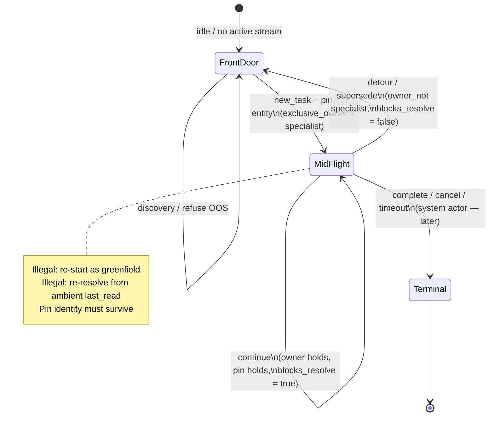

# Conjecture Behaviour Runner — public contract (spec)

| Field | Value |
|---|---|
| **Document role** | **Public contract / design spec** for the open-source project (not a commercial product brief) |
| **Status** | Alpha (0.1) — design stated; Slice 0 ships a **narrow** vertical |
| **Defensible one-liner** | **Contract testing for the conversational control plane** — behavioral envelopes over authoritative state under pinned/replayed cognition |
| **Alternate** | Stateful conformance testing for probabilistic workflows |
| **Package** | `conjecture-behaviour-runner` · import `conjecture_behaviour_runner` · **MIT** |
| **Companion (reference domain)** | [Conversation Control Plane](https://github.com/walidnegm/conversation-control-plane) |

This document is the **spec**. The [README](../README.md) is the short public face.  
Claims below distinguish **what is true today** from **aspiration**.

---

## 1. Problem and claim

### What is genuinely valuable

Probabilistic conversational systems should be tested against a **behavioral envelope** —
**permitted outcomes** plus **invariants over authoritative state** — not against one exact
sentence or one ideal trajectory.

| Ingredient | Role |
|---|---|
| **Cognition pins** | Separate probabilistic semantic interpretation from deterministic execution testing |
| **Allowed outcomes** | Multiple conversational landings can be correct |
| **Invariants** | Must remain true regardless of wording or path |
| **Authoritative focus** | Ownership, active work identity, routing, terminals, ledger integrity |

None of those ingredients is novel alone. The defensible combination is:

> **Authoritative control-plane conformance under probabilistic cognition.**

Not “a completely new testing paradigm.”

### Failure modes that string / pure quality scores miss

| What goes wrong | Why wording checks miss it |
|---|---|
| **Wrong control flow** mid-task | Reply still “looks fine” |
| **Identity or state lost** across turns | No fixed sentence fails |
| **Illegal landing** (restart, wrong mode, silent degrade) | Snapshot of one turn still green |
| **Dual writers / steals** | Trajectory “score” can still be high |

### Slice 0 honesty (critical)

Reference goldens largely:

1. **Inject** a cognition pin  
2. **Inject** ledger effects (`begin_task`, pins, ambient)  
3. Run **pure** control-plane projection functions  
4. Assert owner / pin / extras  

That establishes:

> Given the state transition I injected and the classification I supplied, does the
> contract function return the expected owner / pin / blocks_resolve?

It does **not** yet establish:

> When a user sends this message to the **deployed application**, does classify → route →
> mutate → tools → respond while preserving the contract?

So Slice 0 is a **valuable unit-level contract harness**. NL on the turn is partly
**documentary** until a real **Driver** path exists. `LedgerEffect` should be used for
**arrange / environment** (and external stimuli), not as a substitute for the system’s
own Act side effects long-term.

**Arrange → Act → Observe → Assert** is the target run shape.

---

## 1.1 Behaviour-driven testing and ODD (full objective)

### Behaviour pinning

Agentic and auto-grown systems need **behaviour envelopes**, not exact reply text:

1. Declare **scope** of the claim (what inputs the system says it handles).  
2. Per step/turn: **`allowed_outcomes`** — legal landings (more than one is fine).  
3. **`required_invariants`** — must hold no matter which allowed outcome occurred.  
4. Run under an **execution profile** (stub cognition, live cognition, desktop/mobile, …).  
5. Capture a **trajectory**. Across *N* trajectories of the same (scenario, profile),
   pin **distributions** when cognition is live.

Without invariants + allowed outcomes, “happy path passed” cannot be told from
“happy path passed by accident.”

| Concept | Meaning |
|---|---|
| **Route network** | Map of transitions in the system under test (grows over time) |
| **Scenario** | One goal-directed route with contracts filled |
| **Trajectory** | One observed run of a scenario under one profile |

### Related work (compose; do not straw-man)

| Related | Relation to Conjecture |
|---|---|
| **Playwright** | Complete execution substrate. Conjecture sits **above** it as oracle semantics; Playwright can be **a Driver** (fixtures, traces, isolation). Do not rebuild Playwright. |
| **Cucumber** | Readable scenarios + step defs that can assert **any** state. Not “exact string only.” Conjecture is specialized agent/control-plane oracles; integration is possible. |
| **Hypothesis stateful** | Closest **method** analogue: actions → transitions → invariants → **shrink**. Without generation/shrink, Slice 0 is a **hand-authored** transition API. |
| **Eval platforms** (LangSmith, Braintrust, DeepEval, Promptfoo, Inspect, Phoenix, …) | Already multi-turn / trajectory / tools. Differentiation is **narrower**: verify **authoritative-state contracts** for all acceptable trajectories — not “they only score the model.” |
| **Collinear-class** | Overlap grows with explorers, ODD, N-run distributions. Honest today: they lean **sim/data**; we lean **app control-plane conformance with pinned cognition**. |
| **CARLA / Scenic** | Useful **aspiration** for scenario generation under constraints. Premature as a claim for current code (no world runtime, scheduler, minimizer). |

### Canonical pipeline (target — partial today)

```text
Scenario source → validated Scenario IR → ExecutionPlan
       → Runner (Driver + CognitionProvider + Observer)
       → Trajectory → Oracle results → Report
```

| Layer today | Status |
|---|---|
| `ConjectureScript` / `run_script` / `RunResult` | **Stable Slice 0** |
| Experimental `Scenario` / `Trajectory` / waits / evidence | **Schema + models** — not fully joined to the runner |
| Cognition modes enum | **Labels**; full provider (resolve/record/replay + model identity) not shipped |
| CLI | **Demo** — not a discovery/report/shard test runner yet |

Free-form experimental preconditions/postconditions as **strings** are **descriptions** until a
typed predicate registry or callables exist — do not treat them as executable truth.

### Scripts are multi-actor (user → agent → agent-to-agent)

A script is **not only a human chat transcript**. Turns may be:

| Actor / kind | Role in the script |
|---|---|
| **User** | Human message, chip, finite confirm |
| **Agent** | Specialist step, tool-backed continue, agent-initiated progress |
| **Agent → agent** | Handoff, subagent completion into parent, multi-agent pipeline |
| **System / completion** | Job complete, stream terminal, timeout, cancel, scheduled tick |

Experimental YAML already models this (`Actor`: `user` · `agent` · `system`).
Slice 0’s `DialogueTurn.user_text` is the **user-centric first API**, not the design ceiling.

**Roadmap phasing:**

1. **User-centric (Slice 0+)** — human-led multi-turn scripts; pin-driven cognition.  
2. **Agent-initiated + completion** — steps with no new human utterance (async finish, mid-flight).  
3. **Agent-to-agent** — multi-agent handoffs under the same invariant envelope.  

Throughout: evaluate the **host system’s contracts**, not LLM feedback quality.

### ODD (Operational Design Domain)

**ODD** (ISO 21448 / SOTIF lineage) = specification of the **input space the system
claims to handle** — conditions under which intended function is in scope. It is
**metadata on the scenario class**, not a scenario and not a probe generator.

Portable scenario models use the same idea in plain language:

| Field | Meaning |
|---|---|
| `in_scope` | Supported — handle |
| `out_of_scope` | Unsupported — refuse / degrade gracefully |
| `expected_refusal` | Probes that must be rejected |

### ODD vs adversarial (do not conflate)

| | ODD / scope | Adversarial generation |
|---|---|---|
| **What** | Spec of the claimed boundary | Technique that *uses* the boundary |
| **In-scope stress** | — | “You claimed this — prove under load” |
| **Out-of-scope** | Declared | Refusal / non-crash contracts |
| **Layer** | Scenario-class metadata | Concrete corpus entries |

Adversarial is never the sole CI green without human promote.

### Where use-cases / scenarios are seeded (distinct sources)

Do **not** collapse “generation” into one blob. Seed sources differ in trust and job:

| Source | Input | Output kind | Trust | Status |
|---|---|---|---|---|
| **Specs** | Epics, ODD/scope, design contracts | *Intended* use-cases | High for “claimed” behaviour | **Partial** — humans author; **spec→scenario tooling not built out** |
| **Codebase scan** | Routers, state machines, tools, prompts, existing tests | *Structural* use-cases the code admits | High for “reachable in code” | **Partial** — Slice 0 goldens hand-derived; **auto scan→draft scripts not built out** |
| **Raw scripts / ideas / edge lists** | Free-form seeds, “what if…”, incident notes, sticky edges | *Hypothesis* scenarios and **edge conditions** | Variable — needs curation | **Partial** — hand-written `ConjectureScript`; **idea→formal probe pipeline not built out** |
| **User-watching** | Sessions, transcripts, telemetry | *Empirical* routes | High for “what people do” | **Not built out** |
| **Explorer** | Deployed app drive | *Operational* reachability | High for runtime quirks | **Not built out** |
| **Adversarial from ODD** | Scope + threat generation | *Stress / refusal* probes | Separate triage (refusal ≠ success) | **Seed only**; formal generator **not built out** |

```text
  specs ──────────────┐
  codebase scan ──────┼──► curate / promote ──► scenario + invariants
  raw ideas / edges ──┘         │
                                ▼
                          play back → capture → diagnose
                                │
              later: traffic · explorer · adversarial gen
```

**Slice 0** proves the **play back** column: pinned scripts + real invariant checks.
Automated extractors from specs, code, and raw edge lists are **roadmap**, not
pretend-done.

### Pipeline (still the objective)

```text
extract → curate/learn → play back → capture → diagnose → live debug
   ^                                                         |
   +------------------------- feedback ----------------------+
```

Slice 0 = thin vertical on **play back** (script → pin-driven run → pass/fail).
Extract (specs / code / ideas), curator, capture store, explorer, and formal
adversarial generation remain **to build**.

---

## 2. Project architecture

### Four extension points (product boundary)

| Extension | Responsibility | Examples |
|---|---|---|
| **Driver** | Act on the actual system | HTTP, SSE, WebSocket, Playwright, in-process, Temporal, LangGraph |
| **Observer** | Authoritative evidence | messages, routing, tool I/O, ledger, ownership, terminals, DB, events |
| **Cognition provider** | Probabilistic interpretation | stub, freeze/replay, record, local, cloud, shadow compare |
| **Oracle** | Evaluate envelopes | step asserts, trajectory/temporal invariants, allowed outcomes, later distributions |

Slice 0 collapses Driver+Observer into `ControlPlaneAdapter` and Cognition into turn pins.

### Target cognition provider (not fully implemented)

```python
class CognitionProvider(Protocol):
    def resolve(self, turn, state) -> CognitionDecision: ...
    def record(self, decision, evidence) -> FreezeArtifact: ...
    def replay(self, freeze_key) -> CognitionDecision: ...
```

Artifacts should carry model identity, prompt/version hashes, schema version, seed/temperature
where applicable, raw + parsed output, validation evidence. **Mode labels alone ≠ mode system.**

### Delivery slices (revised priorities)

| Slice | What | Status |
|---|---|---|
| **0** | Script model, pin-driven harness, standard invariants, optional CCP goldens | ✅ |
| **0.1.1 foundations** | `CognitionProvider` + freeze/record disk store; trajectory + outcome-specific oracles; `compile_scenario_to_script` + `run_result_to_trajectory`; CLI `run` / `path-faithful` / JSON+JUnit; **MiniChatApp** path-faithful Act + three planted bugs | ✅ landed (thin but real) |
| **1 next** | Host HTTP/SSE/Playwright drivers; live freeze from real classifiers; agent **script synthesizer** (spec→JSON golden) | open |
| **2** | Richer temporal ops; generation + shrink; production runner (shards, retries, timeouts) | open |
| **3** | ODD-driven corpus / explorer / N-run **contract hold-rate** distributions | open |

### 0.1.1 module map

| Module | Role |
|---|---|
| `cognition.py` | `CognitionProvider`, `FreezeStore`, stub/freeze/record |
| `temporal.py` | Cross-turn oracle kinds |
| `compile_scenario.py` | Scenario IR → `ConjectureScript`; `RunResult` → `Trajectory` |
| `path_faithful.py` | Mini-app Act path + planted-bug proof |
| `discover.py` / `report.py` / `cli.py` | Discovery, JSON/JUnit, `conjecture run` |

---

## 2.1 Pipeline, ecosystem, and Collinear

Public face of this section: [README — pipeline · ecosystem · Collinear](../README.md#end-to-end-pipeline-spec--agent--runner--verify).

### Pipeline (normative)

```text
Spec / epic / story / ODD / incident
        → Agent interface (draft against Conjecture schema; validate; repair)
        → ConjectureScript IR (deterministic golden)
        → Runner (CognitionProvider + Driver + Observer)
        → Oracle (step + outcome-specific + trajectory)
        → Report (RunResult / Trajectory / JUnit) → CI gate
```

Agent interface **authors**; runner **executes**; oracle **verdicts**. The schema is the
shared “score surface” for agents — not free-form pass criteria.

### Ecosystem

Compose with Collinear-class sim (upstream seeds / optional downstream re-probe),
Playwright/HTTP (drivers), pytest/CI (host), coding agents (author IR), eval platforms
(parallel trajectory scores — not a substitute for contract gates).

### Collinear: differentiate and integrate

| | Collinear-class | Conjecture |
|---|---|---|
| Job | Sim users/worlds, multi-turn **data**, rubrics | **Control-plane contracts** under pin/freeze |
| Green bar | Quality / task / preference scores | Owner · pin · terminal · refusal envelope |
| Integration | → seed scripts; ← failed contracts as sim regression seeds | CI gate on authoritative state |

**Tempting features that would erase the wedge** (happy/sad quality scores, built-in sim
world, creative execution engine, logger-as-product) stay **out of core** — see README
scope table.

Not the mission: replace general runners or become a sim-data platform.

### What would make the repo materially credible

One uncompromising vertical:

1. Start a **real** example application  
2. Send **actual** NL messages through its public interface  
3. **Record or freeze** real cognition decisions  
4. Observe **real** authoritative ledger mutations  
5. Evaluate **cross-turn** invariants  
6. Produce structured **trajectory + failure report**  
7. Plant **three** application bugs and prove Conjecture catches them  
8. Run under **pytest + CI** with deterministic replay  

Compelling demo line:

> “The wording changed, the model changed, and the route varied — but the conversation
> never created two active owners, never mutated completed work, and always returned to
> the suspended task.”

---

## 4. Cognition modes (honest status)

| Mode | Intended meaning | Slice 0 reality |
|---|---|---|
| `stub` | Pin on the turn | **Implemented** path — pin-driven |
| `freeze` / `record` | Replay / capture freeze artifacts | Labels + `freeze_key` field; full provider not shipped |
| `local` / `cloud` | Host-routed real classifier | Fail-closed without host-supplied pins; no built-in model lifecycle |

The portable core is **pin-driven**. It does not call an LLM factory.

---

## 4.1 Script structure (Slice 0 + multi-turn design)

Friendly intro + mini-story: [README — Script language](../README.md#script-language-what-you-write).  
This section is the **formal shape** and **why multi-turn needs more than a single assert**.

### Why multi-turn scripts (not one-shot checks)

Agentic systems fail **between** turns: ownership flips, pins drop, resolve re-runs,
detours steal mid-flight, completion lands without a human message. A single-turn
assert (“owner was X once”) does not prove the **stream** stayed legal.

A **script** is therefore an **ordered trajectory of steps** over one conversation
(or multi-agent pipeline). Each step may change host state; each step ends with
**invariants** (and optionally **allowed outcomes**) that must hold **after** that step.

```text
  initial_context
        │
        ▼
  turn 1  →  pin?  →  effects  →  observe  →  invariants ✓/✗
        │
        ▼
  turn 2  →  … (context carries forward) …
        │
        ▼
  turn N  →  … terminal / mid-flight contract …
```

What **must carry** across turns (host projection; adapter fills observation):

| Carries | Why multi-turn cares |
|---------|----------------------|
| **Conversation / session id** | Same thread; not a fresh greenfield each step |
| **Active task / kind** | Sole-continue vs new_task vs detour |
| **Exclusive owner** | Who may act next; dual-writer / steal detection |
| **Entity pins** | Same workflow/project/subject — not ambient last_read |
| **Phase / mid-flight flags** | e.g. `blocks_resolve` during sole-continue |
| **Pending / completion** | Job done, cancel, timeout as system turns later |

What **does not** need to match turn-to-turn: assistant wording, markdown layout.

### Formal types (portable core — Slice 0)

Implemented in `script.py` / `pins.py` / `protocol.py`.

#### `ConjectureScript`

| Field | Type | Role |
|-------|------|------|
| `script_id` | `str` | Stable golden id (CI / reports) |
| `description` | `str` | Human intent of the behaviour claim |
| `conversation_id` | `str` | Thread identity for the run |
| `turns` | `DialogueTurn[]` | Ordered steps (length ≥ 1 for real goldens) |
| `initial_context` | `dict` | Host projection seed (ledger-like facts) **before** turn 1 |
| `tags` | `str[]` | Optional corpus labels (`sole_continue`, `detour`, …) |
| `scope` | `ScriptScope?` | **Mini-ODD** — claimed input boundary for this script class |

#### `ScriptScope` (mini-ODD on the script)

Same plain language as experimental Scenario `Scope` / SOTIF-style ODD. Slice 0
treats scope as **metadata on the claim** (included in `RunResult.artifact`);
automated probe generation from scope is a later slice.

| Field | Role |
|-------|------|
| `in_scope` | Conditions / inputs the system **should** handle for this class |
| `out_of_scope` | Unsupported — refuse or degrade gracefully |
| `expected_refusal` | Probes that must be **rejected** (illegal restart, hijack, …) |

```python
from conjecture_behaviour_runner import ScriptScope, ConjectureScript, DialogueTurn

scope = ScriptScope(
    in_scope=["multi-turn sole-continue on a pinned entity"],
    out_of_scope=["free live model quality scoring"],
    expected_refusal=["entity re-resolve while blocks_resolve"],
)
```

#### `DialogueTurn` (one step)

| Field | Type | Role |
|-------|------|------|
| `user_text` | `str` | Primary stimulus (Slice 0 user-centric surface) |
| `actor` | `str` | `user` \| `agent` \| `system` — default `user`; multi-actor later |
| `pin` | `CognitionPin?` | Stub/freeze labels for this step (`task_intent`, kinds, …) |
| `effects` | `LedgerEffect[]` | Deterministic host mutations after cognition, before invariants |
| `invariants` | `InvariantSpec[]` | **Must hold after** this step |
| `allowed_outcomes` | `str[]` | Optional envelope when cognition is live (later slices) |
| `freeze_key` | `str` | Optional key for freeze/record mode replay |

#### `InvariantSpec`

| Field | Type | Role |
|-------|------|------|
| `kind` | `str` | Stable checker code (see below) |
| `expected` | any | Kind-specific target |
| `reason` | `str` | Optional human note for failures / docs |

#### `CognitionPin` (portable)

Portable cognition labels for the step. Host-specific router flags go in **`extras`** —
do not grow the public pin type with host-private fields.

Typical portable fields: task/read/discovery-style enums the host maps into ownership.
See `pins.py` and optional CCP adapter.

#### `LedgerEffect`

| Field | Type | Role |
|-------|------|------|
| `op` | `str` | Host-defined op (`ensure_task`, `set_pin`, `clear_task`, …) |
| `payload` | `dict` | Op arguments |

Effects let a script **set up** mid-flight state without a free live LLM (e.g. ensure
active task + pin already present before “continue”).

#### `TurnObservation` (adapter → harness)

| Field | Type | Role |
|-------|------|------|
| `exclusive_owner` | `str?` | Who owns this turn after apply |
| `active_kind` | `str?` | Active task/kind |
| `pins` | `dict` | Bound entity ids |
| `context` | `dict` | Updated host projection |
| `observed_outcome` | `str?` | Optional outcome code |
| `extras` | `dict` | Host facts (`blocks_resolve`, preferred ids, …) |

Invariants read **only** the observation (plus kind rules). Unknown kinds **fail closed**.

### Standard invariant kinds

| Kind | Multi-turn meaning |
|------|--------------------|
| `exclusive_owner` | After this step, owner is still (or now) X |
| `owner_not` | Owner must not remain X (e.g. detour superseded) |
| `active_kind` / `kind_equals` | Active kind matches |
| `pin_present` | Key has a **usable** bound value (not missing / null / empty / `False`) |
| `pin_absent` | Missing or null |
| `pin_key_missing` | Key not in the pins map |
| `pin_equals` | **Same** entity as earlier step — strict `==` |
| `extra_true` / `extra_false` | Key **present** and value is strictly `True` / `False` (**missing ≠ false**) |
| `extra_missing` | Key not in extras |
| `extra_equals` | Host extra equals value |
| `observed_outcome` | Adapter outcome code |
| `always_true` | Smoke only |

Full list: `STANDARD_INVARIANT_KINDS` in `invariants.py`.

**Oracle gaps (roadmap):** temporal (`always` / `eventually` / `until` / `never before`),
exactly-once side effects, outcome-**specific** invariant sets (outcome A ⇒ {A1,A2}),
idempotency keys. Flat global invariant lists cannot express all branching behaviour.

**Harness contracts (sealed):**

- If `allowed_outcomes` is non-empty, `observed_outcome` is **required** (no vacuous green).  
- `TurnObservation.context`: `None` = no update; `{}` = explicit clear; mapping = replace.

### Multi-turn script patterns (authoring guidance)

These are **scenario-class patterns**, not phrase lists. Use tags + turn sequences.

| Pattern | Shape of turns | Typical invariants |
|---------|----------------|--------------------|
| **Sole-continue** | Setup (new task + pin) → `continue` | `exclusive_owner`, `pin_present`/`pin_equals`, `extra_true` `blocks_resolve` |
| **Detour supersedes** | Mid-flow specialist → discovery/detour pin | `owner_not` specialist, `exclusive_owner` front_door (or detour owner), often `extra_false` `blocks_resolve` |
| **Pin beats ambient** | Pin set → stimulus that might re-resolve | `pin_equals` to pinned id; `blocks_resolve` or preferred id extras |
| **Illegal restart** | Mid-flight chip/text that must **not** re-start | `owner_not` reset path; kind still mid-flight (host-defined) |
| **Agent / completion** *(later)* | `actor=agent` or `system` with empty/minimal text | Same envelope: owner, pin, terminal honesty |
| **Agent → agent** *(later)* | Handoff + parent continue | Exclusive owner + pin identity; no double-write |

**Greenfield vs mid-flight:** greenfield scripts seed little `initial_context` and open a
task. Mid-flight scripts **seed or effect** active task + pins first, then probe continue /
detour / completion. Most production bugs live mid-flight — author there.

**Multi-actor (design):** experimental YAML already has `Actor`: `user` · `agent` ·
`system`. Slice 0 `DialogueTurn.actor` defaults to `user`. Same invariant language applies
when the stimulus is not a human chat line.

### Script vs experimental `Scenario`

| | **ConjectureScript** (Slice 0) | **Scenario** (experimental / later) |
|--|-------------------------------|-------------------------------------|
| Purpose | CI-safe multi-turn **play back** | Rich route: scope/ODD, profiles, waits, evidence |
| Step unit | `DialogueTurn` | `Step` (actor, control_point, maneuver, wait, …) |
| Cognition | Pin + modes | Nondeterminism + execution profiles |
| Status | **Stable enough for goldens** | Quarantined; not 0.1 public API |

Scripts do not go away when Scenario lands: scripts remain the thin multi-turn
**control-plane** vertical; Scenario adds ODD metadata, UI/async waits, and trajectory
evidence for broader surfaces.

### Run loop (harness contract)

For each turn, roughly:

1. Resolve cognition (stub pin / freeze / later live)  
2. Apply `effects` via adapter  
3. `observe_turn` → `TurnObservation`  
4. Evaluate each `InvariantSpec` (fail closed on unknown kind)  
5. Record turn result; abort or continue per runner policy  
6. Carry `context` into the next turn  

Result: `RunResult` (`passed`, `failures[]`, `turn_results[]`, `artifact` including
`scope` and `tags` when set).

### Mid-flight state machine (reference domain)

Reference scenario class: **multi-turn turn ownership** (sole-continue, detour,
pin continuity). Not the whole project ODD — the first sealable class.



ASCII (always renderable):

```text
                    ┌─────────────┐
         idle       │ front_door  │◄── detour supersedes
                    └──────┬──────┘     (blocks_resolve false)
                           │ new_task + pin
                           ▼
                    ┌─────────────┐
         continue   │ mid-flight  │──► continue (owner + pin + blocks_resolve)
         loop       │  specialist │
                    └──────┬──────┘
                           │ complete / cancel (system — later)
                           ▼
                    ┌─────────────┐
                    │  terminal   │
                    └─────────────┘

  Mid-flight must NOT: re-start assessment · drop pin · ambient last_read hijack
```

Map to script patterns:

| Transition | Script pattern | Typical invariants after step |
|------------|----------------|-------------------------------|
| Front door → mid-flight | Setup turn + `begin_task` / effects | `exclusive_owner` = specialist |
| Mid-flight → mid-flight | Sole-continue | owner + `pin_*` + `extra_true` `blocks_resolve` |
| Mid-flight → front door | Detour | `owner_not` specialist, often `extra_false` `blocks_resolve` |
| Ambient must not steal pin | Pin-beats-ambient | `pin_equals` + preferred id extras |

### Full sole-continue golden (JSON / YAML)

Canonical examples in the repo (same content):

- [`examples/sole_continue_golden.json`](../examples/sole_continue_golden.json)
- [`examples/sole_continue_golden.yaml`](../examples/sole_continue_golden.yaml)

Load without hard-coding Python:

```python
from conjecture_behaviour_runner import load_script_json, run_script, LlmMode
# YAML: load_script_yaml(...) needs pip install ...[scenarios]

script = load_script_json("examples/sole_continue_golden.json")
# result = run_script(script, adapter=your_adapter, llm_mode=LlmMode.STUB)
assert script.scope is not None
assert script.scope.in_scope
assert len(script.turns) == 2
```

Abbreviated JSON shape:

```json
{
  "script_id": "sole_continue_owns_the_turn",
  "description": "Continue mid cost-out: owner, pin, blocks_resolve",
  "conversation_id": "conv_sole_continue_demo",
  "tags": ["control-plane", "sole-continue"],
  "scope": {
    "in_scope": ["multi-turn sole-continue on a pinned entity"],
    "out_of_scope": ["free live model quality scoring"],
    "expected_refusal": [
      "entity re-resolve from ambient last_read while blocks_resolve"
    ]
  },
  "turns": [
    {
      "actor": "user",
      "user_text": "cost out the onboarding workflow",
      "pin": { "task_intent": "continue" },
      "effects": [{
        "op": "begin_task",
        "payload": {
          "kind": "cost_out",
          "pins": { "workflow_id": "wf_1" }
        }
      }],
      "invariants": [
        { "kind": "exclusive_owner", "expected": "cost_out" }
      ]
    },
    {
      "actor": "user",
      "user_text": "make the volume 10k",
      "pin": { "task_intent": "continue" },
      "invariants": [
        { "kind": "exclusive_owner", "expected": "cost_out" },
        { "kind": "pin_present", "expected": "workflow_id" },
        { "kind": "extra_true", "expected": "blocks_resolve" }
      ],
      "allowed_outcomes": ["continue_owned"]
    }
  ]
}
```

Play back with `ControlPlaneStreamAdapter` (`[control-plane]` extra) or any host
adapter that implements `begin_task` + the standard observation fields.

---

## 5. Public API (0.1 / Slice 0)

```python
from conjecture_behaviour_runner import (
    LlmMode,
    CognitionPin,
    DialogueTurn,
    InvariantSpec,
    LedgerEffect,
    ConjectureScript,
    ScriptScope,
    ControlPlaneAdapter,   # Protocol
    NullControlPlaneAdapter,
    BaseControlPlaneAdapter,
    check_standard_invariant,
    run_script,
    script_from_dict,
    load_script_json,
    load_script_yaml,      # needs [scenarios] / PyYAML
)
```

Implement `ControlPlaneAdapter` (or subclass `BaseControlPlaneAdapter`) against your ledger or the Conversation Control Plane package. The null adapter is packaging smoke only.

**Optional CCP binding:**

```python
from conjecture_behaviour_runner.contrib.control_plane import (
    ControlPlaneStreamAdapter,
    control_plane_golden_scripts,
)
```

Requires `pip install conjecture-behaviour-runner[control-plane]`.

**Experimental** (not stable 0.1 API): `conjecture_behaviour_runner.experimental` — scenario YAML models and trajectory shapes for later surface drivers. YAML loading needs `pip install conjecture-behaviour-runner[scenarios]` (PyYAML).

---

## 6. Explicit non-goals

- Replacing Playwright, pytest, or Cucumber as general-purpose runners  
- Rebuilding sim/world platforms as the core mission  
- Claiming CARLA-class generation/runtime **today**  
- Live LLM on every PR by default  
- Phrase laundry lists as cognition  
- Claiming Conjecture *is* the Conversation Control Plane (it **proves** contracts; CCP is one surface)  
- Claiming Slice 0 goldens are path-faithful production proofs  

---

## 7. License & status

MIT. Alpha.

| Horizon | Intent |
|---|---|
| **Wedge** | Control-plane conformance under pinned/replayed cognition |
| **Slice 0** | Script + invariants + optional CCP contract unit goldens |
| **Next** | Path-faithful vertical + planted-bug proof + CI freeze/replay |
| **Then** | Driver/Observer/CognitionProvider, Scenario→Trajectory join, temporal oracles, shrink |

Host adapters and host-private goldens stay in host repos; this package keeps a portable, leak-free surface.

**Document name:** *public contract (spec)* — file `docs/conjecture-behaviour-runner.md`.

---

## 8. Contributions, Verdict, and foundational ideas

See the public README for the full tables:

- [Where open-source contributions can go](../README.md#where-open-source-contributions-can-go)
- [Conjecture (OSS) vs Verdict (commercial)](../README.md#conjecture-oss-vs-verdict-commercial)
- [Foundational ideas](../README.md#foundational-ideas-open-for-community-or-verdict)

**Normative summary:**

1. MIT core welcomes portable drivers, observers, providers, oracle kinds, agent
   synthesizers, ecosystem bridges, CLI, and docs.  
2. **Verdict** (commercial) may host, accelerate, or reimplement product surfaces
   independently — it is not required to land every idea in OSS first, and OSS is
   not blocked by Verdict.  
3. Host-private goldens stay out of this repository.  
4. Foundational ideas (schema-as-agent-API, arrange≠act, freeze for CI, sim bridge
   not sim core, temporal packs, contract hold-rates) are shared design stakes —
   implementable by community **or** commercial without changing IR meaning.
